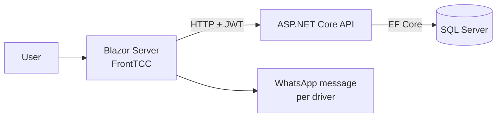

# Logistics management system (undergraduate thesis)

Web system for a last-mile delivery company, built as my final project (TCC) for the Information Systems degree at UFN. Graded 10.

## The problem

Driver payments were calculated in spreadsheets: count each driver's deliveries per fortnight, apply the price per city and delivery type, add extras and discounts, then send each driver their statement. It was slow and easy to get wrong.

## What it does

- Registers drivers, cities, states, delivery types and prices.
- Records delivery counts per driver and fortnight, split between headquarters and inland routes.
- Calculates each driver's fortnight payment (extras, discounts, advances) and marks it as paid.
- Builds the payment statement message for each driver, ready to send on WhatsApp.
- Login with JWT and two permission levels (admin and operator).

## Stack

- **API:** ASP.NET Core 8 (REST), Entity Framework Core, SQL Server, JWT, Swagger
- **Front end:** Blazor Server (.NET 8) with Blazorise / Bootstrap
- **Database:** SQL Server (schema in `tcc.sql`)

## Architecture

- `API/`: controllers per entity (drivers, deliveries, payments, cities, states, users), EF Core models and JWT auth.
- `FrontTCC/`: Blazor pages for records, delivery counts and the fortnight closing.
